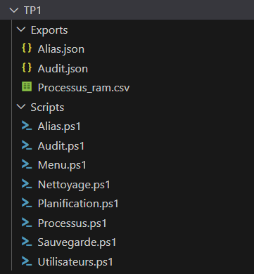
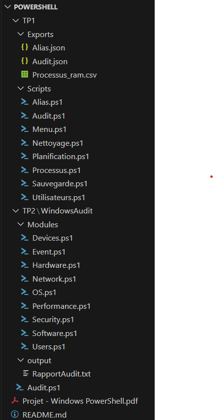
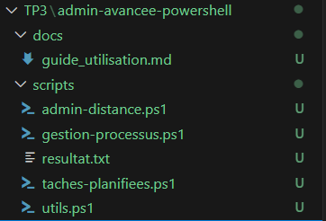
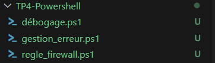
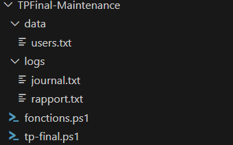

# PowerShell 

# TP1
# Automatiser l'administration d'un poste Windows - Script PowerShell

## Structure du TP1

##  But du projet 

Ce projet a pour objectif de fournir des **scripts PowerShell** permettant d'administrer rapidement les **postes Windows**, notamment :

Le nettoyage de fichiers non utilisés
La mise en place d'un backup
La planification de tâches

##  Instructions d'exécution

1. Ouvrir PowerShell **en tant qu'administrateur**.
2. Exécuter le script de votre choix

# TP2
# Audit Système Windows - Script PowerShell

## Structure du TP2

##  But du projet 

Ce projet a pour objectif de fournir des **scripts PowerShell** permettant de récupérer rapidement les **informations principales d'un poste Windows**, notamment :

- Informations matérielles (PC, RAM, CPU, disques)
- Logiciels installés
- Statut de la sécurité (pare-feu et antivirus)
- Utilisation système (CPU, RAM, disques)
- Événements récents
- Comptes et groupes locaux
- Informations réseau
- Imprimantes et périphériques USB
- Informations système d'exploitation

##  Instructions d'exécution

1. Ouvrir PowerShell **en tant qu'administrateur**.
2. Exécuter le script de votre choix

# TP3
# Administration Avancée avec PowerShell  - Script PowerShell

## Structure du TP3

##  But du projet 

Ce projet a pour objectif de fournir des **scripts PowerShell** permettant d'effectuer rapidement des **tâches avancées d'administration systèmes** en local ainsi qu'à distance via PS-Remoting, notamment :

- Lancer une tâche en arrière-plan
- Générer un rapport d'espace disque 
- Planifier l'exécution d'une tâche

##  Instructions d'exécution

1. Ouvrir PowerShell **en tant qu'administrateur**.
2. Exécuter le script de votre choix

# TP4-Powershell
#  Projet Sécurité & Débogage - Script PowerShell

## Structure du TP4

##  But du projet 

Ce projet a pour objectif de fournir des **scripts PowerShell** permettant d'effectuer des **test script et modification de paramètre sécurité** notamment :

- Déboguer un script
- Gérer les erreurs 
- Modififier des règles de pare-feu

##  Instructions d'exécution

1. Ouvrir PowerShell **en tant qu'administrateur**.
2. Exécuter le script de votre choix

# TPFinal-Maintenance
# Centre de Maintenance Windows - Script PowerShell

## Structure du TPFinal

##  But du projet 

Ce projet a pour objectif de créer un menu via un **script PowerShell** permettant de faire **la maintenance d'un PC Windows efficacement**, notamment :

- Maintenance système 
- Gestion utilisateur 
- Services Windows 
- Gestion du registre 
- Rapport et journalisation 

##  Instructions d'exécution

1. Ouvrir PowerShell **en tant qu'administrateur**.
2. Exécuter le script tp-final.ps1