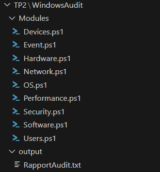

# PowerShell 

# TP1
# Automatiser l'administration d'un poste Windows - Script PowerShell

##  But du projet 

Ce projet a pour objectif de fournir des **scripts PowerShell** permettant d'administrer rapidement les **postes Windows**, notamment :

Le nettoyage de fichiers non utilisés
La mise en place d'un backup
La planification de tâches

##  Instructions d'exécution

1. Ouvrir PowerShell **en tant qu'administrateur**.
2. Exécuter le script de votre choix

# TP2
# Audit Système Windows - Script PowerShell

##  But du projet 

Ce projet a pour objectif de fournir des **scripts PowerShell** permettant de récupérer rapidement les **informations principales d'un poste Windows**, notamment :

- Informations matérielles (PC, RAM, CPU, disques)
- Logiciels installés
- Statut de la sécurité (pare-feu et antivirus)
- Utilisation système (CPU, RAM, disques)
- Événements récents
- Comptes et groupes locaux
- Informations réseau
- Imprimantes et périphériques USB
- Informations système d'exploitation

##  Instructions d'exécution

1. Ouvrir PowerShell **en tant qu'administrateur**.
2. Exécuter le script de votre choix

Structure du projet :

